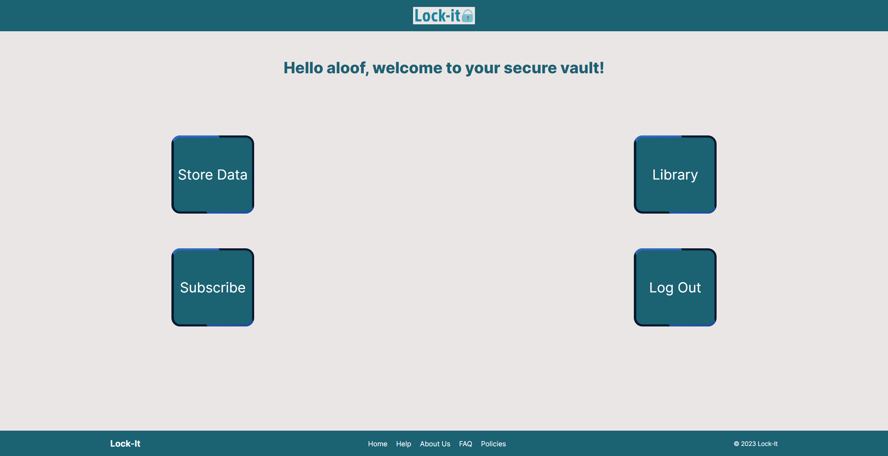
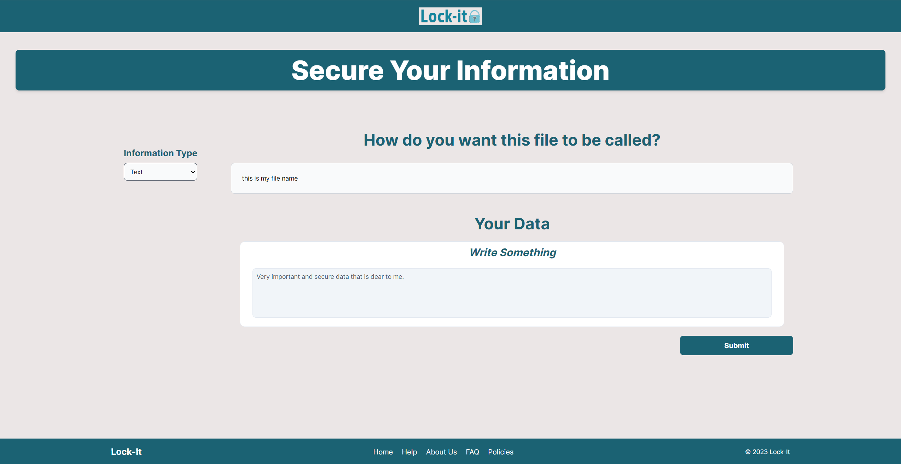
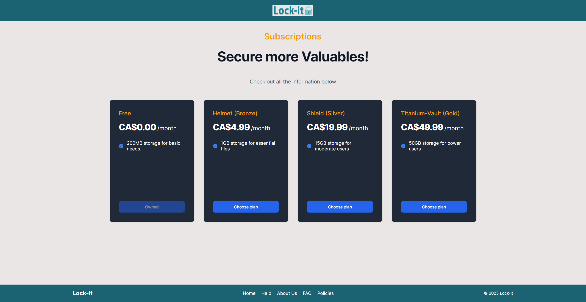

# Team-BSD-Bell-Hackathon-2023

## Lock-It

Lock-It is a secure data storage system that aims to provide its users with a complete sense of security and privacy.

Lock-It uses various encryption and security features that prevent unauthorized access to the user's data.

Lock-It also promises its users a 99.999999999% durability of storing data.

Lock-It does not have any access to its users' information, it acts as a messenger that retrieves data from its users in a secure fashion and stores it in a secure vault.

## Screenshots of Lock-It

### Home Page

### Store Data

### Plans

## Stripe Checkout

