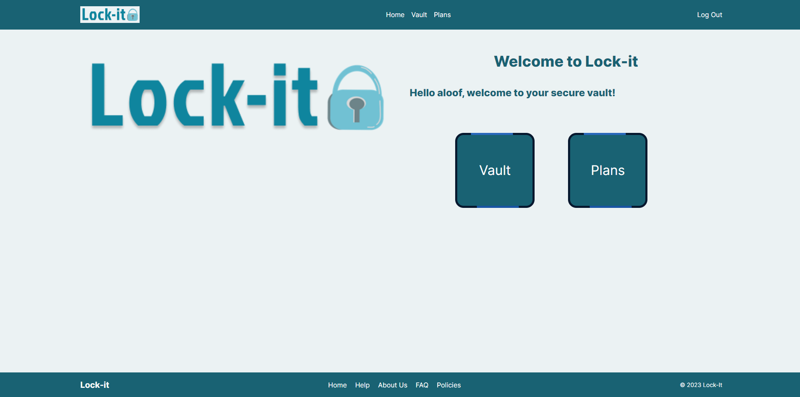
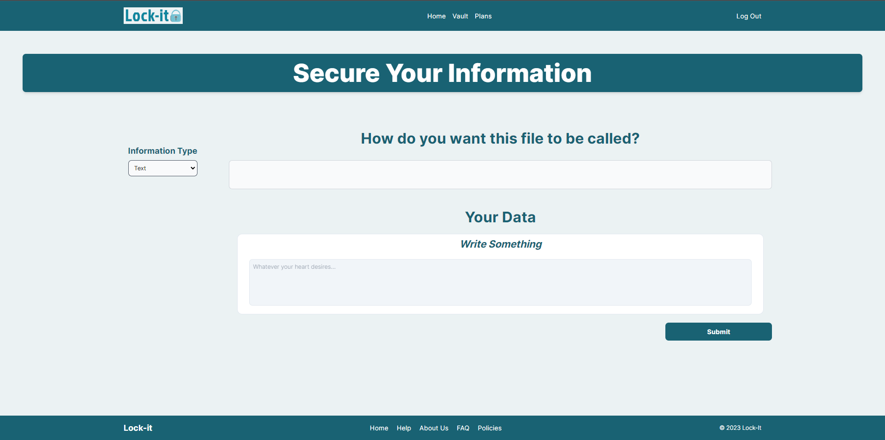
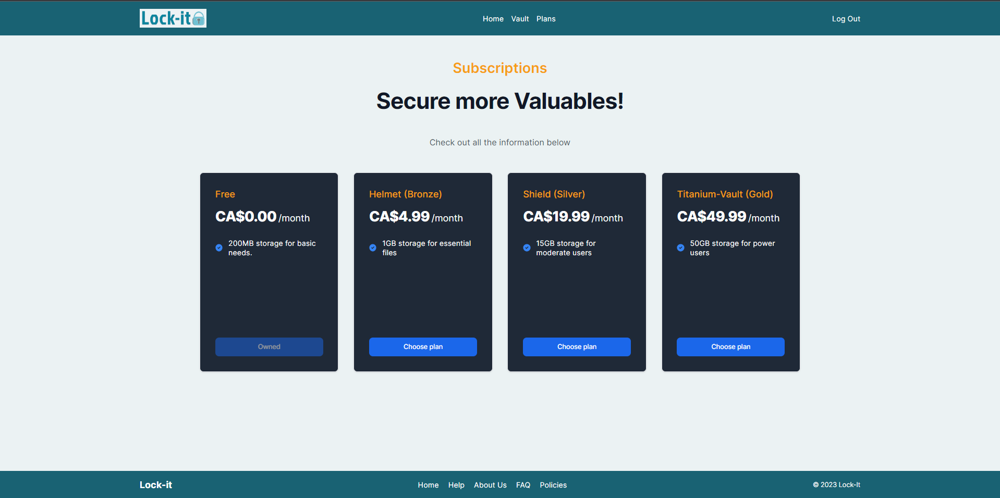
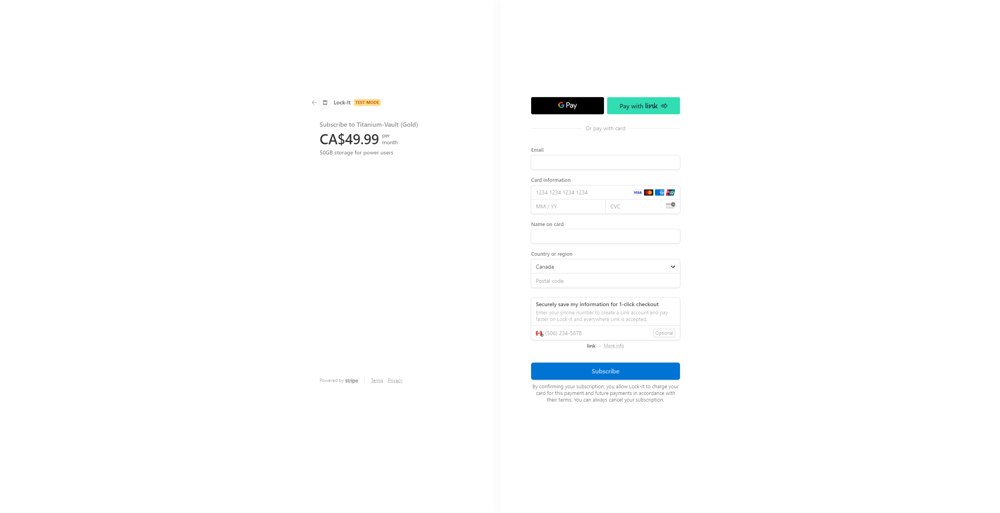
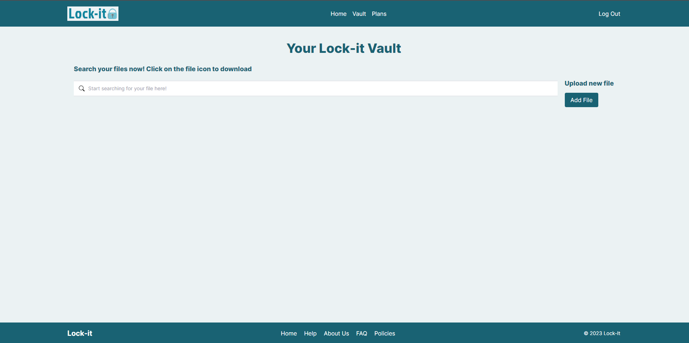

# Team-BSD-Bell-Hackathon-2023

## Team Members

[Andrii Sych](https://github.com/SychAndrii)  
[Majd Al Mnayer](https://github.com/Mounayer)  
[Mohammed Aminoor Rahman](https://github.com/Mrahman141)  
[Tatiana Kashcheeva](https://github.com/Amoraa)  

## Lock-It

Lock-It is a secure data storage system that aims to provide its users with a complete sense of security and privacy.

Lock-It uses various encryption and security features that prevent unauthorized access to the user's data.

Lock-It also promises its users a 99.999999999% durability of storing data.

Lock-It does not have any access to its users' information, it acts as a messenger that retrieves data from its users in a secure fashion and stores it in a secure vault.

## Screenshots of Lock-It

### Home Page

### Store Data

User is able to store any image, file, or text securely.

### Plans

Plans are available to accomodate the user's specific needs.

### Stripe Checkout

### The Vault

The user is able to browse the data they stored.

## Technologies Used

    - AWS S3: Used to store BLOBS (images, files, videos, etc...)
    - MongoDB: Used to store file metadata
    - AWS KMS: Used to create unique keys for every user that are used in encryption
    - AWS Cognito: Used for secure authentication and Bearer tokens are used for authorization
    - AWS Lambda: Used to create a trigger for AWS Cognito to create a new key in AWS KMS whenever a new user signs up
    - Helmet: Used to enhance the security of the express app by providing extra security headers
    - Stripe: Used to handle various transactions and operations securely

## Backend

    - Node.js
    - Express.js
    - SSL Encryption

## Frontend

    - Next.js
    - Tailwind CSS
    - Fuse.js for searching

## How it works

After the user is signed up, whenever the user stores data securely using Lock-It, the data is encrypted during transit to the back-end. When the back-end receives the data, it is immediately encrypted using a unique key from AWS KMS that was created when the user has signed up. Then, the data is stored on AWS S3.

When the user requests their data, the backend verifies their identity using the Bearer Token the frontend holds, afterwards, the backend retrieves the KMS key for that specific user, retrieves the data requested, decrypts it, and transmits it securely back to the user.

The user is able to browse all the data they stored using Lock-It and has complete control over it.

## Required Environment Variables

### Backend

    - AWS_COGNITO_POOL_ID
    - AWS_REGION
    - AWS_COGNITO_CLIENT_ID
    - AWS_ACCESS_KEY_ID
    - AWS_SECRET_ACCESS_KEY
    - AWS_S3_BUCKET_NAME
    - MONGO_URL
    - DATABASE_NAME

### Frontend

    - NEXT_PUBLIC_AWS_COGNITO_POOL_ID
    - NEXT_PUBLIC_AWS_COGNITO_CLIENT_ID
    - NEXT_PUBLIC_AWS_COGNITO_HOSTED_UI_DOMAIN
    - NEXT_PUBLIC_OAUTH_SIGN_IN_REDIRECT_URL
    - NEXT_PUBLIC_OAUTH_SIGN_OUT_REDIRECT_URL
    - NEXT_PUBLIC_API_URL
    - API_STRIPE_KEY
    - STRIPE_SECRET_KEY
